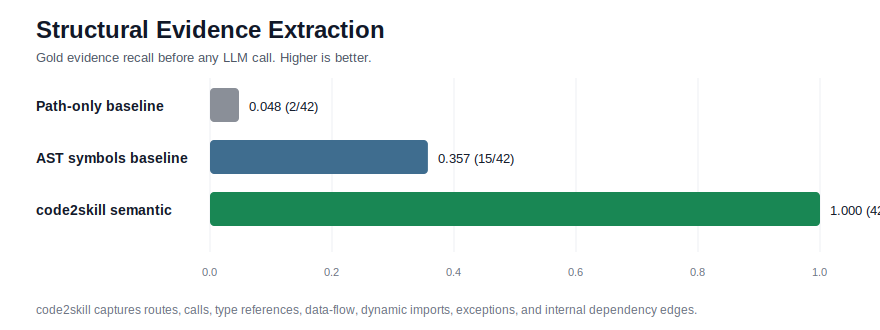

# Benchmarks

This repository uses a focused benchmark for the part of the product that can be
tested without API keys: structural evidence extraction before Skill planning and
generation.

## Public Benchmark Context

The benchmark is not a replacement for end-to-end agent benchmarks. It is scoped
to the context-selection and evidence-extraction layer that `code2skill` owns.

- SWE-bench evaluates whether a system can resolve real GitHub issues end to end:
  https://arxiv.org/abs/2310.06770
- RepoBench evaluates repository-level context for code completion:
  https://arxiv.org/abs/2306.03091
- CodeSearchNet evaluates semantic code search and retrieval quality:
  https://arxiv.org/abs/1909.09436

Those benchmarks are useful reference points, but `code2skill` is not an issue
solver by itself. Its first measurable job is to extract repository evidence that
later prompts can use without inventing architecture.

## Local Benchmark

Command:

```bash
python benchmarks/evaluate_structural_evidence.py
```

Outputs:

- `benchmarks/results/structural-evidence-benchmark.json`
- `docs/assets/structural-evidence-benchmark.svg`

The fixture repository contains Python route, service, schema, dynamic plugin,
runtime loader, main-guard, state, and exception-handling examples. The gold set
contains 42 structural facts that are useful for writing grounded Skills:

- file roles
- imports and internal dependency edges
- functions, classes, and methods
- route decorators
- service calls and call chains
- type references
- model/schema signals
- dynamic imports
- data-flow edges
- raised exceptions
- main guards

## Baselines

`path-only` uses only filename, directory, suffix, and path-role heuristics.

`ast-symbols` uses a plain standard-library AST walk for imports, top-level
classes, top-level functions, and class methods.

`code2skill-semantic` uses the current scanner: AST symbols, route extraction,
call targets, type references, model/schema signals, dynamic imports, data-flow
edges, raised exceptions, main guards, import graph resolution, and internal
dependency edges.

## Results

| Method | Gold hits | Gold total | Recall |
|---|---:|---:|---:|
| path-only | 2 | 42 | 0.048 |
| ast-symbols | 15 | 42 | 0.357 |
| code2skill-semantic | 42 | 42 | 1.000 |



## Limits

The benchmark is intentionally small and deterministic. It proves that the
scanner extracts more Skill-relevant structural evidence than simple baselines,
but it does not measure generated prose quality, model behavior, or issue
resolution success. Those require separate model-in-the-loop evaluation.
